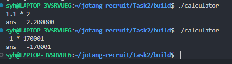

# Task2

简易计算器编写在本项目的./Task2目录下，具体的执行过程为
1.将仓库克隆至合适位置
2.进入仓库目录
3.在命令行中依次输入
```
cd ./Task2
mkdir build
cd build
cmake ..
make
```

即可在build目录下找到可执行文件`calculator`

词法分析规则文件为`clac.l`

语法分析规则文件为`clac.y`

具体实现过程参见文件内注释

附运行截图：


