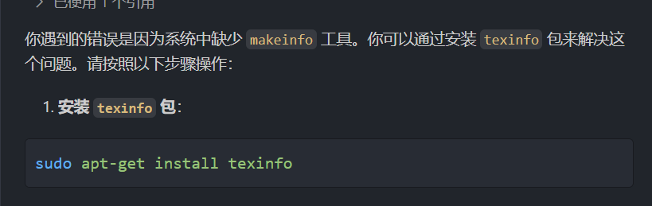
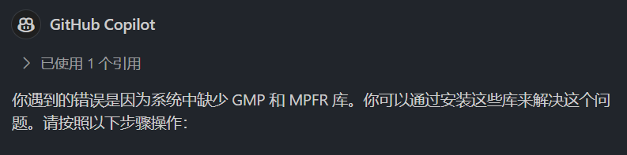
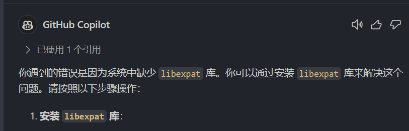
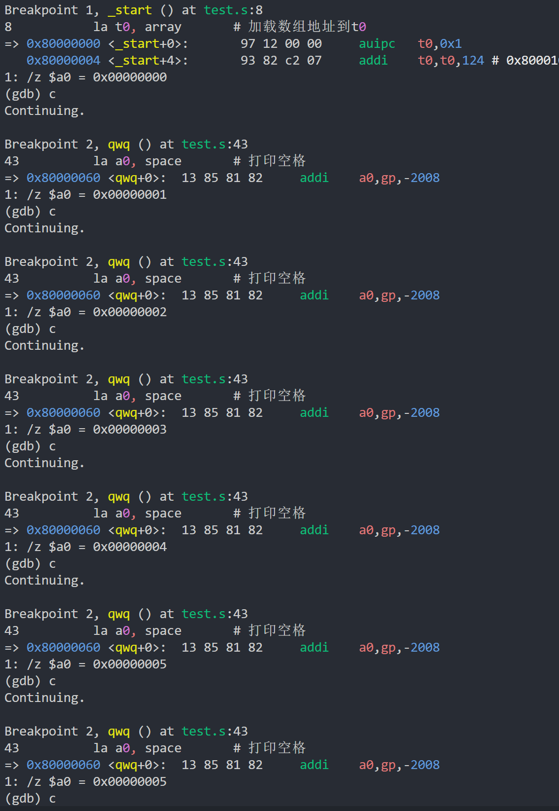

# Task3
有关riscv的学习内容我记在
[个人博客-RISCV学习笔记](https://www.creamgreen.xyz/article/10d555f7-8779-8042-bdde-f4654bd6e305)
中了
冒泡排序的riscv汇编在本目录下的`bubble.s`文件中
不得不说搭建riscv环境，还有用gdb交叉编译是有点烦人的qwq，各种库各种装才终于搞定。。

系统调用输出还会导致程序崩溃，有点烦了遂用gdb输出过程信息，请见谅qwq

可以看到a0寄存器内的值在排序后依次增大，说明排序程序有效。